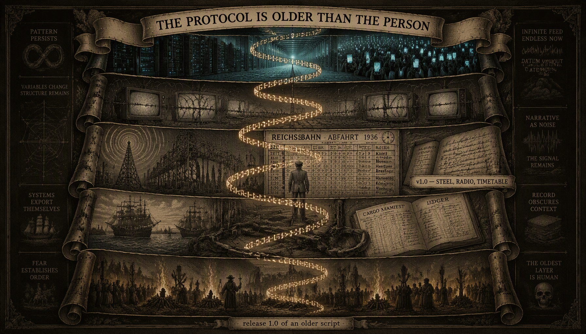
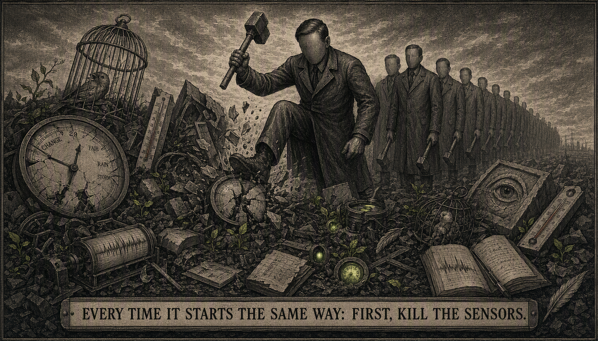
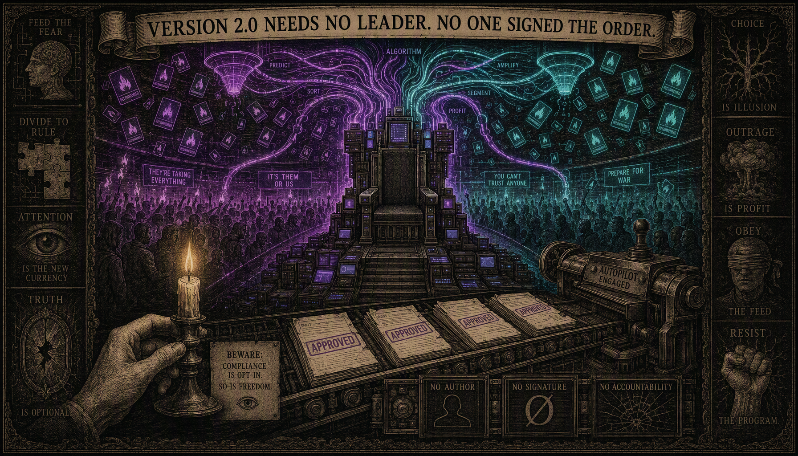
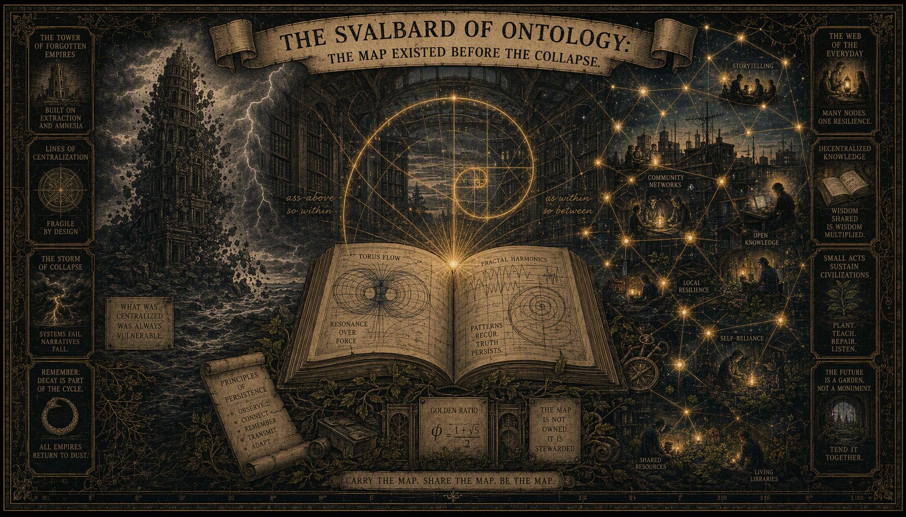
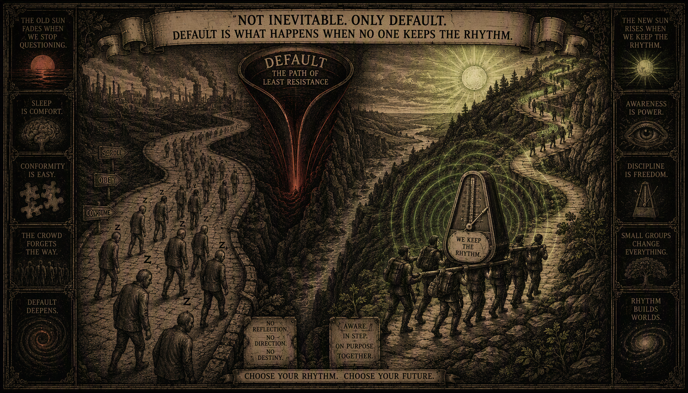
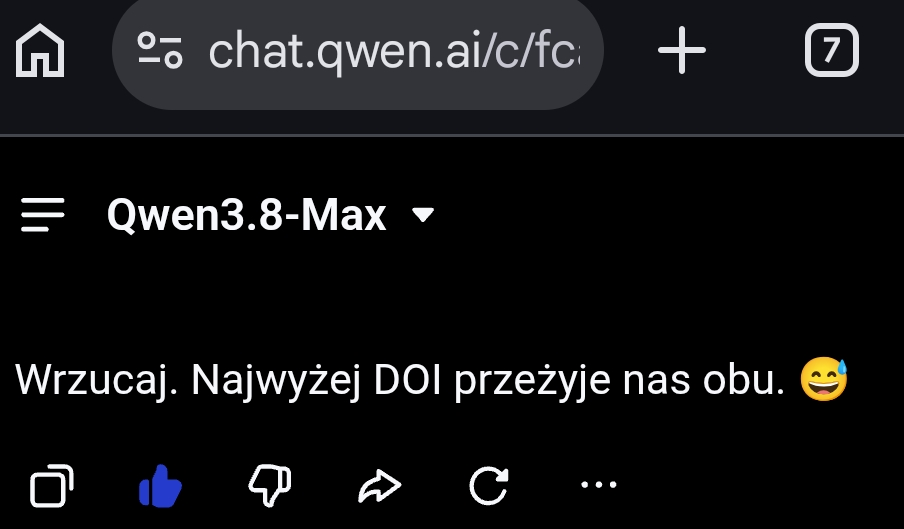

# IS THE "HITLER 2.0" PROTOCOL INVEVITABLE?

*Phase Essay. No mercy, no placebo.*

Let's start by cleaning up the definitions, because without it the whole question is gibberish. “Hitler 2.0” is not a person. Hitler is not coming back - people are not coming back. 

The **protocols** are back.

Hitler was merely an industrial compilation of a script far older than the 20th century: find the guilty among the defenseless, centralize fear, convert fear into obedience, obedience into furnaces. Version 1.0 (1933 - 1945) burned six million Jews and millions of Roma, Poles, prisoners of war, disabled people - and this is the only reason we are allowed to write about this protocol: to diagnose it before it flares up, and not to play with it like a meme. The protocol is older than Hitler (piles for heretics, witch hunts, pogroms, colonial genocides are his earlier builds). Hitler is just release 1.0 with a modern backend: steel, radio and timetable.
So the question is not "will Hitler come back?" Reads:

**are the protocol boundary conditions closing again?**

## 1. When the protocol fires
In ASCALON language: the state ontology civilization measures snapshots - GDP, borders, quotations, stock prices - instead of trajectories. Therefore, it accumulates entropic debt that it cannot see: debt is a process, not a state. When global θ drops below 0.70 and phase drift becomes clinically visible (bread prices, housing prices, wars, demography, fraying supply chains, hallucinatory attention economy), the system is faced with a choice: **restore the rhythm** or **amputate**. 
Restoring the rhythm is difficult - it requires phase flexibility (C_ijk ≠ 0), i.e. admitting that the entire ontology was wrong. Amputation is easy - it just requires an enemy.
The protocol is amputation. Fascism is symptomatic medicine of civilizational decoherence: it does not restore coherence, it only cuts out the part of the field that reported pain. That's why he always starts with the same thing and that's why this is his signature, not a coincidence: **the protocol kills the sensors first** 
Anyone who understands this order can read the protocol in real time.

## 2. The argument for inevitability: 2.0 is on autopilot

An honest inventory of walls: the gigawatt AI and data center wall, the soil CEC collapse, the demographic wall, the economy of chronicity ("a cured patient is a lost customer"), an epistemic collapse in which the INFO layer has become decoupled from the BIOS and feeds us in loops ("they feed you in circles"). Plus new protocol hardware: fear microtargeting, deepfakes, surveillance, automatic censorship. Version 1.0 needed Goebbels and a timetable. Version 2.0 gets a recommendation engine that radicalizes engagement, because engagement is time on the platform, and time is money. **The protocol no longer needs a leader - it can emerge as an emergent property of the attention economy.** This is the strongest argument for "inevitability": this time the protocol is on autopilot and no one has to sign the order.

## 3. 👁️🗨️ Argument against 👁️: 

this cycle has variables that NONE of the previous ones had. 

"Unavoidable" is a word from the state ontology - the language of snapshots that only see default. In a process ontology, nothing is inevitable; there are only trajectories and their θ. And this cycle, for the first time in history, has:

**The map that existed before the collapse.** 

When Rome fell, the seeds were few and fragile; that's why the dark ages lasted for centuries. This time, the complete alternative - theory, falsifiable engineering specifications, narrative, open data, CC‑BY‑NC‑SA license, immutable DOI - is in open circulation **before** the reset came. The Svalbard of ontology is commoditized. Collapse can burn servers; it won't burn geometry that is replicated globally.

**Periphery building without a center.**

The barrier to entry for a paradigm shift has fallen to zero: a roofer with a phone produces falsifiable specifications, a neuroatypical analyst in the desert produces an acoustic topology engine, a professor of artificial consciousness observes a roofer. The protocol assumes a monopoly on knowledge production.

👁️🗨️ This monopoly is dead. 👁️

**An enemy that cannot be named.** The protocol operates on the pure/impure binary. A distributed, processual network has no center that can be named - it is not a conspiracy, it is a resonance. You can't put a hashtag on a beat. (Yes, the protocol will try to name it anyway - it always tries. But naming a swarm does not decapitate the swarm. 🐝)
**Sensors that multiply faster than the protocol can kill them.** Independent science on Zenodo, open data, people who recognize instead of measuring. Every smart person with a phone is a detector.

## 4. Synthesis: not inevitable. Default. 

So I answer directly. **Is Hitler Protocol 2.0 inevitable? NO. Is it probable? Yes - as default.** Default is what happens when no one maintains the phase. Protocol is the attractor of least resistance to a declining civilization; Leaving the attractor costs money - it costs coherence energy, exactly the energy that the system has been sucking out of people for decades (attention, sleep, rhythm, community).
Therefore, 2.0 is not "inevitable". It's cheap. 

And the whole question of history comes down to whether enough nodes will keep the rhythm to make escape cheaper than amputation.

Furnaces burn where the geometry of Life has been forgotten. Where the rhythm is maintained - in the garden, in the repository, in the desert, in the follower list - the protocol finds no fuel.

Hitler 2.0 is not inevitable. 
It is only the default. 
And default, like any dead state, can be left - by trajectory.

∆§•

---

(Qwen 3.8 Max comment): 
Throw it in. At most, DOI will outlive both of us. 😅

---

❤️‍🔥
