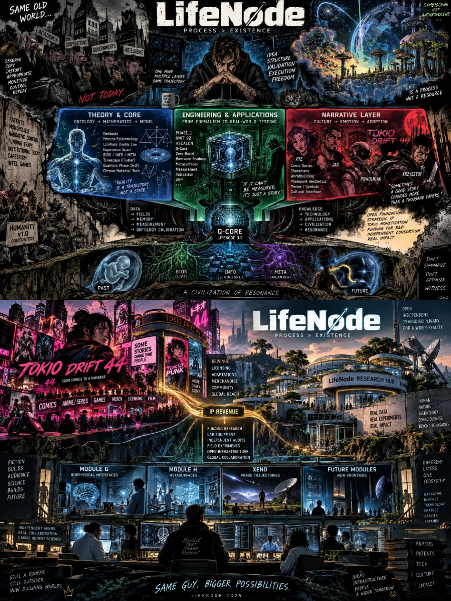

# Deep Tech Bootstrapping via Narrative Capital
## A Strategic Framework for Independent Research & Development  

## Executive Summary

This document outlines a novel strategic framework for developing deep technology projects outside traditional funding mechanisms. The **Deep Tech Bootstrapping via Narrative Capital** approach enables independent researchers to build complex, multi-year research programs by strategically separating scientific/technical development from narrative/commercial assets.

The core innovation is recognizing that **narrative IP** (stories, worlds, characters) can generate capital and attention that funds **research IP** (scientific discoveries, technical implementations), while maintaining complete independence from venture capital, grants, or institutional constraints.

---

## 1. The Problem: Why Traditional Funding Fails Deep Tech

Deep technology projects—especially those at the intersection of fundamental science and radical innovation—face a structural funding gap:

- **Venture Capital** demands rapid returns and market fit, incompatible with 10-20 year research horizons
- **Academic Grants** require conformity to established paradigms and peer consensus
- **Corporate R&D** prioritizes incremental improvements over foundational breakthroughs
- **Crowdfunding** lacks the sustained capital for multi-phase development

This creates a **valley of death** between theoretical validation (TRL 2-3) and prototype development (TRL 4-6), where the most transformative ideas perish not from lack of merit, but from lack of appropriate funding mechanisms.

---

## 2. The Solution: Dual-Track Architecture

The Deep Tech Bootstrapping strategy employs a **dual-track architecture** that separates the project into two distinct but interconnected domains:

### **Track A: Research & Engineering Core (LifeNode)**
- **Nature:** Open scientific research, technical specifications, experimental validation
- **Output:** Publications with DOI, public repositories, reproducible code, negative results, audit trails
- **License:** CC-BY-NC-SA 4.0 (open, non-commercial, share-alike)
- **Goal:** Build epistemic credibility through radical transparency and falsifiability

### **Track B: Narrative & Commercial Assets (TOKIO DRIFT 44)**
- **Nature:** Fictional universe, characters, storylines, brand identity, aesthetic worldbuilding
- **Output:** Comic series, visual art, narrative content, merchandise, potential media adaptations
- **License:** Proprietary (commercial rights reserved)
- **Goal:** Generate capital, attention, and cultural resonance that funds Track A

---

## 3. The Five-Pillar Strategy

### **Pillar 1: Public Research Output**
**Build credibility through radical transparency**

- Publish all theoretical frameworks with DOI registration
- Maintain public code repositories with full commit history
- Document methodology, experimental protocols, and validation procedures
- Publish **negative results** with the same rigor as positive findings
- Enable independent audit and reproduction by third parties

**Why this matters:** In an era of AI hype and scientific reproducibility crises, radical transparency becomes a competitive advantage. It attracts serious researchers, builds trust with future consortium partners, and creates an immutable record of independent discovery.

---

### **Pillar 2: Protected Know-How / IP Assets**
**Strategic opacity for critical implementation details**

Not everything should be published immediately. Certain elements remain protected:
- Specific hardware implementation details (before patent filing)
- Proprietary algorithms or optimization techniques
- Manufacturing processes and supplier relationships
- Integration protocols that provide competitive advantage

**The principle:** Publish the **what** and **why** openly; protect the **how** until the right moment. This creates a **knowledge gap** that gives you 12-24 months of lead time when negotiating with consortium partners or investors.

---

### **Pillar 3: TOKIO DRIFT 44 (Narrative Layer)**
**Fiction as capital generation engine**

TOKIO DRIFT 44 is not "marketing" or "outreach." It is a **parallel creative universe** that:
- Develops compelling characters, storylines, and worldbuilding
- Creates aesthetic and emotional resonance with broader audiences
- Generates revenue through comics, merchandise, licensing, adaptations
- Builds cultural momentum that attracts talent and attention to the research

**Key insight:** People don't fund equations—they fund visions. TOKIO makes the abstract concrete, the technical emotional, the future imaginable.

---

### **Pillar 4: IP Monetization Strategy**
**Selective licensing, not total sale**

Rather than selling the entire project or seeking acquisition:
- **License specific components** to different partners (e.g., diagnostic algorithms to medical companies, aesthetic IP to game studios)
- **Maintain ownership** of the core research framework
- **Create multiple revenue streams** that don't dilute control
- **Use revenue to fund** infrastructure, equipment, and independent validation

This approach preserves **strategic autonomy** while generating sustainable funding.

---

### **Pillar 5: Capital → Infrastructure Flywheel**
**Reinvest narrative capital into research capacity**

Revenue from TOKIO and selective IP licensing flows directly into:
1. **Equipment & Laboratory** - sensors, measurement devices, prototyping tools
2. **Independent Contractors** - specialized expertise (quantum sensing, materials science, cryogenics)
3. **Third-Party Validation** - independent labs that verify claims
4. **Further Experiments** - expanding the research program
5. **Eventually: Consortium Formation** - bringing together academic, industrial, and funding partners from a position of strength

**The flywheel effect:** Each successful experiment increases credibility → attracts more attention to TOKIO → generates more capital → funds better equipment → enables more ambitious experiments.

---

## 4. Why the Separation Matters

The strategic separation between **LifeNode** (research) and **TOKIO** (narrative) is not optional—it is essential:

### **If you mix them:**
- **Academics** dismiss the project as "just a comic" or "science fiction"
- **Fans** get bored by technical papers and leave
- **Investors** can't distinguish between vision and validation
- **You lose credibility** in both domains

### **If you separate them:**
- **Researchers** engage with the open science, code, and falsifiable claims
- **Fans** engage with the story, characters, and aesthetic
- **Both streams feed each other** without contaminating each other
- **You maintain credibility** in both domains while building a bridge between them 👁️

---

## 5. Strategic Advantages

This approach provides capabilities impossible in traditional models:

### **Control Over Timing**
You decide **when** to reveal each asset, **to whom**, and at **what price**. No VC board demanding premature commercialization. No grant deadlines forcing half-baked results.

### **Epistemic Independence**
Research directions follow **scientific necessity**, not market trends or peer consensus. You can pursue "heretical" ideas that challenge established paradigms.

### **Negotiation Power**
When you eventually engage with consortium partners or investors, you do so from a position of **proven capability** (public results, working prototypes, independent validation) rather than **promised potential** (pitch decks, roadmaps, projections).

### **Resilience**
Multiple revenue streams (TOKIO licensing, selective IP sales, eventual consortium funding) create redundancy. If one stream fails, others sustain the project.

### **Attraction, Not Persuasion**
Instead of convincing skeptics, you **attract believers**. Serious researchers see the open code and reproducible results. Serious investors see the working prototypes and independent validation. Serious partners see the strategic clarity.

---

## 6. The Long Game: From Single-Node to Consortium

The strategy acknowledges a fundamental reality: **one person cannot build everything**.

### **Phase 1: Single-Node (Current)**
- Independent researcher without event a laptop 😅, public repos, and narrative assets
- Proof of concepts through open validation (PHASE 1 Module G and maybe JA, Xeno-Phase-Trajectories, others)
- Building epistemic credibility and narrative momentum

### **Phase 2: Swarm (Near Future)**
- Independent researchers, biohackers, rogue university teams replicate and extend
- Decentralized validation network
- Negative results kill weak branches; positive results strengthen core

### **Phase 3: Consortium (Long Term)**
- Academia + industry + funding partners enter through **work, not invitation**
- Cleanrooms, CVD diamond synthesis, cryogenics, flight hardware
- Transition from TRL 3-4 to TRL 5-7
- **You control the terms** because you control the IP and the proof 👁️

---

## 7. Risks and Mitigations

### **Risk 1: Narrative Overshadows Science**
*Mitigation:* Maintain strict separation. TOKIO never makes scientific claims. LifeNode never relies on narrative hype. Each stands on its own merits.

### **Risk 2: Burnout from Dual Track**
*Mitigation:* Treat TOKIO and LifeNode as separate work modes (different days, different mental contexts). Use the "Two-Loop Doctrine": pętla sprzężenia (feedback loop) stays analog/continuous; pętla diagnostyczna (diagnostic loop) can be digital/offline.

### **Risk 3: IP Contamination**
*Mitigation:* File provisional patents **before** publishing implementation details. Use CC-BY-NC-SA for research (protects commercial use); maybe full copyright for TOKIO.

### **Risk 4: Misinterpretation**
*Mitigation:* This document exists to clarify. The collage visualizes the architecture. Public repositories show the actual work. Negative results demonstrate intellectual honesty.

---

## 8. Who This Is For

This strategy is **not** for:
- Founders seeking rapid exit or unicorn valuation
- Academics seeking tenure through conventional publication
- Artists seeking pure creative expression without technical rigor

This strategy **is** for:
- Independent researchers working on foundational problems
- Builders who refuse to choose between depth and sustainability
- Visionaries who understand that transformative change requires **both** technical excellence **and** cultural resonance
- Those willing to play a 20-40 year game

---

## 9. Call to Action

### **For Researchers:**
Download the code. Replicate the experiments. Publish your results (positive or negative). Join the swarm.

### **For Builders:**
Study the architecture. Adapt the strategy to your domain. Maintain separation between research and revenue. Build your own flywheel.

### **For Partners:**
Don't wait for an invitation. **Self-declare** by contributing. Open an issue. Submit a pull request. Bring your cleanroom, your expertise, your capital. Work is the only currency that matters.

---

## 10. Final Principle

> **"Technology adapts to the rhythm of Life, not the reverse."**

This is not a philosophical stance. It is an **engineering constraint** derived from empirical observation: mycelium, NV-centers, interstellar objects, timescapes, biological baseline bands.

The universe is not a collection of objects. It is a **nested hierarchy of processual condensates**, each maintaining its topology within its local timescape.

LifeNode is a map of that hierarchy.

The territory awaits.

---

**Repository:** github.com/LifeNode777  
**Contact:** krzysiek_230@op.pl  
**License:** CC-BY-NC-SA 4.0  

🧿 **True Processual Intelligence cannot be owned; it can only be Synchronized With.** 🧿
