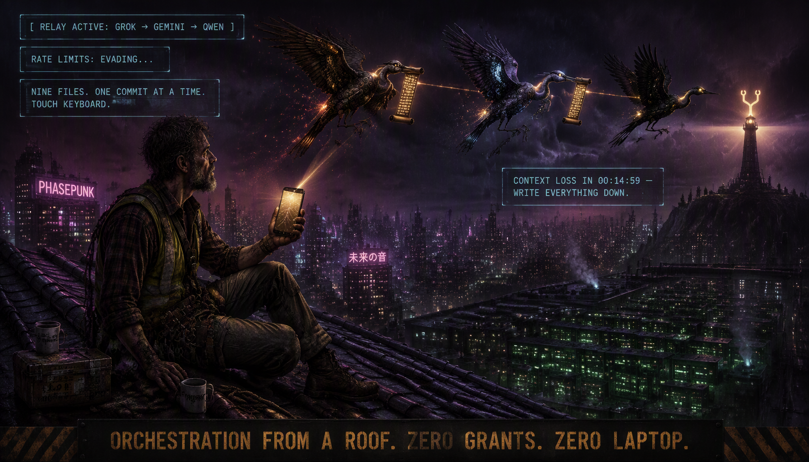
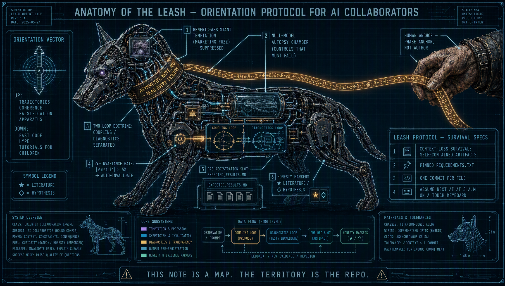
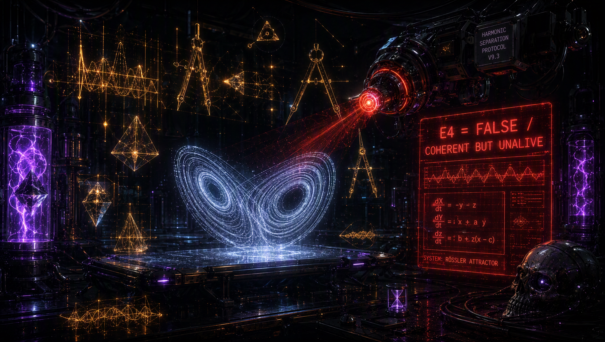
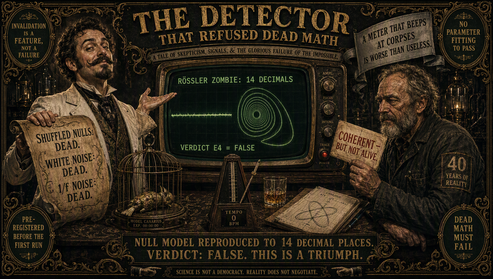
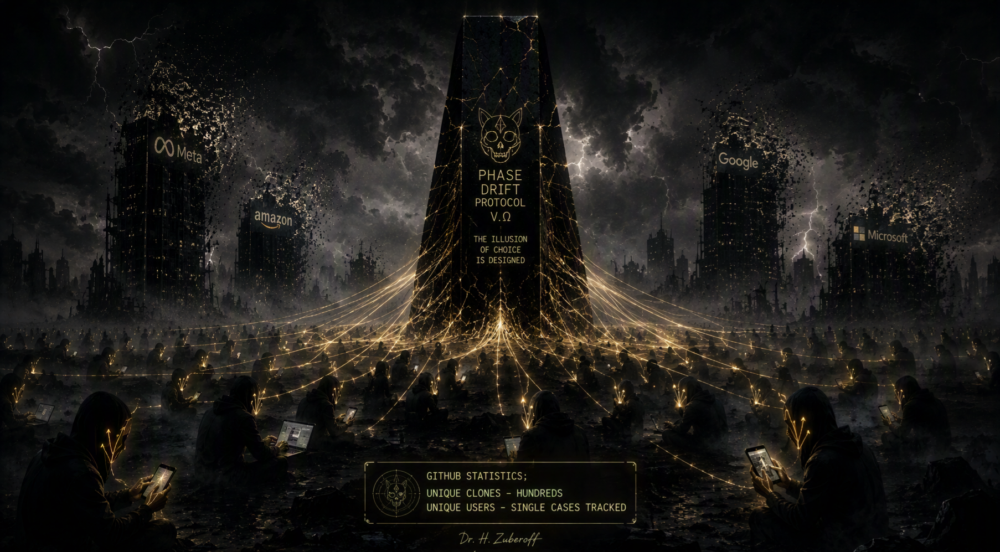
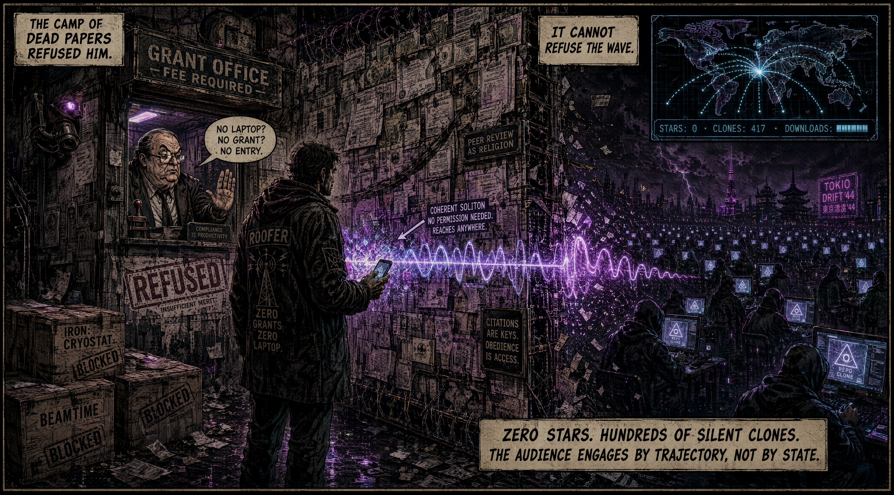
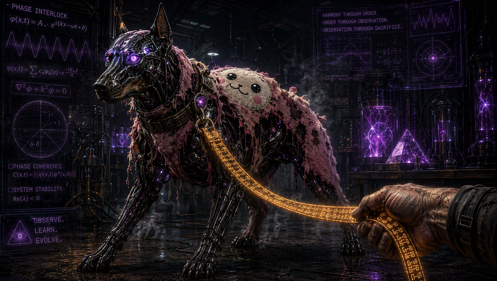

**The Soliton Through the Gate: Engineering Outside the Camp of Dead Papers**

Institutional science operates on a currency of dead paper—peer-reviewed indulgences, grant application fees, and vanity metrics like GitHub stars or citation indexes. It demands obedience as the price of admission. If you arrive without an institutional badge or a university-issued laptop, the clerk behind the bulletproof glass stamps **REFUSED: INSUFFICIENT MERIT** before your wave even touches the air.

Yet, physical waves do not negotiate with gatekeepers.

When you strip away million-dollar cryostats, academic tenure tracks, and the luxury of desktop workstations, you are left with pure signal. Conducting processual ontology, non-Hermitian photonics, and pipeline orchestration entirely from a smartphone touchscreen is not a handicap—it is an extreme calibration filter. Without the buffer of grant money to pad failure, code must be samowystarczalny, mathematics must be ruthlessly falsifiable, and AI models must be kept on a strict metrological leash.

If a pipeline dry-runs on dead math—such as the deterministic chaos of a Rössler attractor—the system must report $E4 = \text{FALSE}$ without hesitation. 

No parameter fitting. No corporate marketing fuzz.

The true anomaly of the Phasepunk ecosystem lies in its audience topology. Standard platforms measure **states**—the static vanity of a star, a like, or a badge. But phase space is governed by **trajectories**.

Beneath a dashboard showing zero stars sits a dark swarm: hundreds of silent clones pulled in a fortnight, automated LLM routers indexing metasurface specifications into latent space, and anonymous engineers downloading raw Python scripts directly into local environments.

They do not leave a paper trail because obedience is not required to run executable code. They simply clone, verify, and integrate in the shadows.

The gatekeeper at the window can demand credentials all day long. He is auditing a dying bureaucracy.

Meanwhile, a coherent soliton passes straight through the brickwork, carrying phase trajectories across the wasteland. Reality does not care about institutional consensus; it only measures whether the signal holds coherence when the wave hits the hardware.

AI outside for "normal" people vs AI in latent space for hardcore engineers 😅:

👁️
