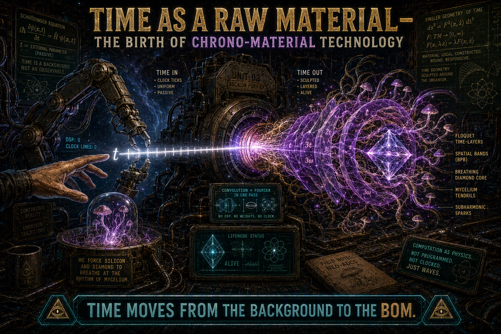
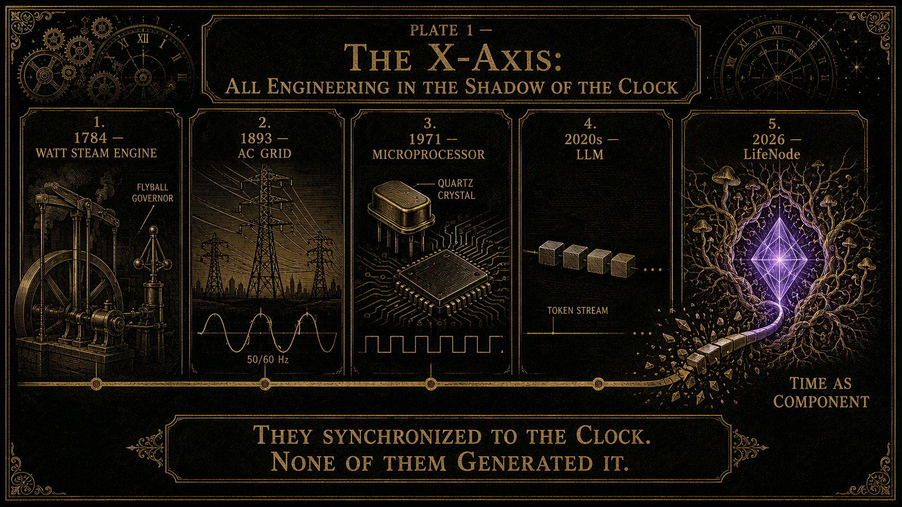
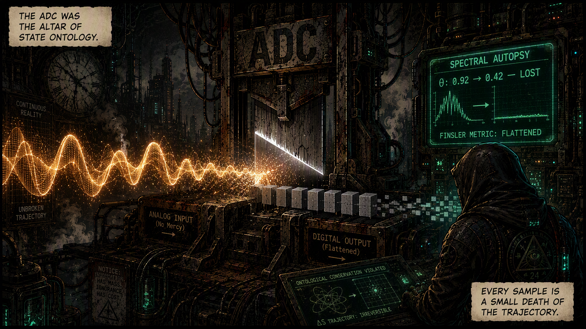
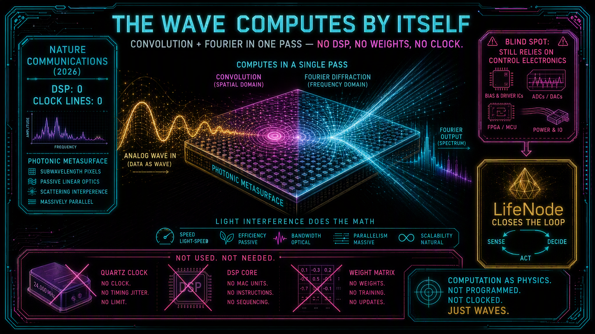
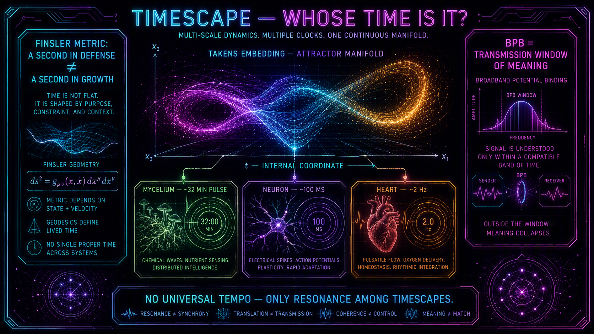
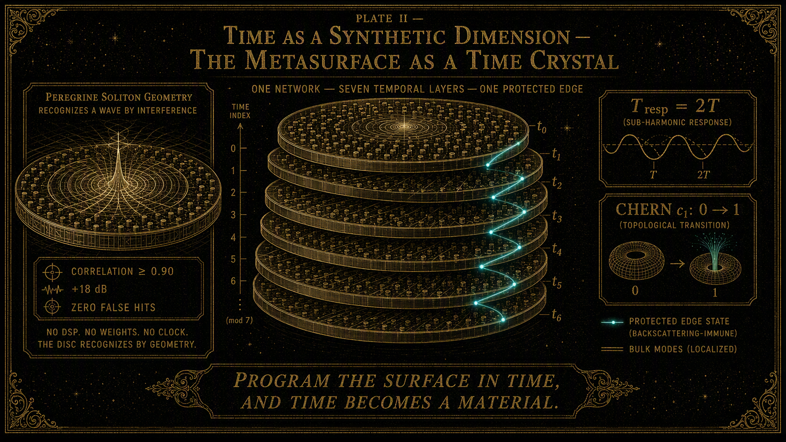
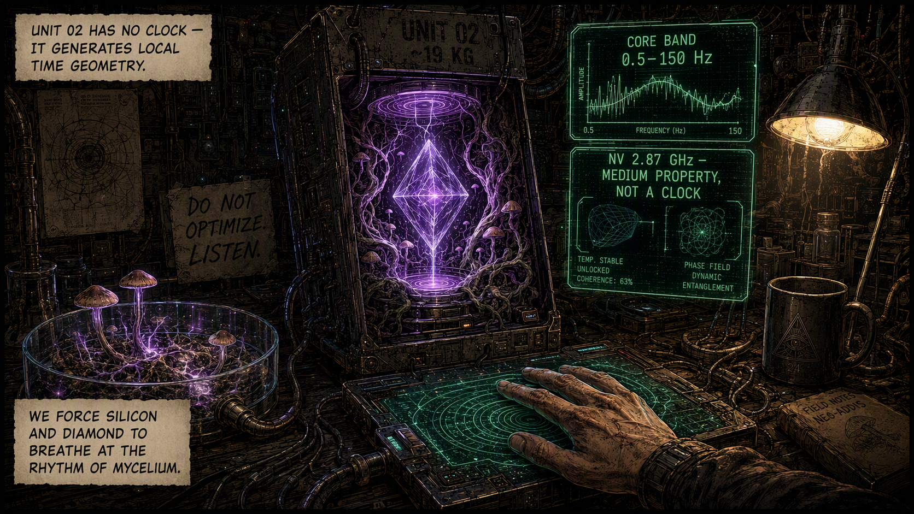
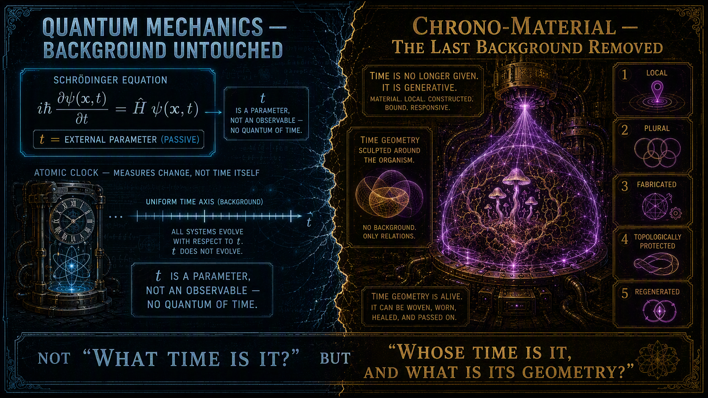
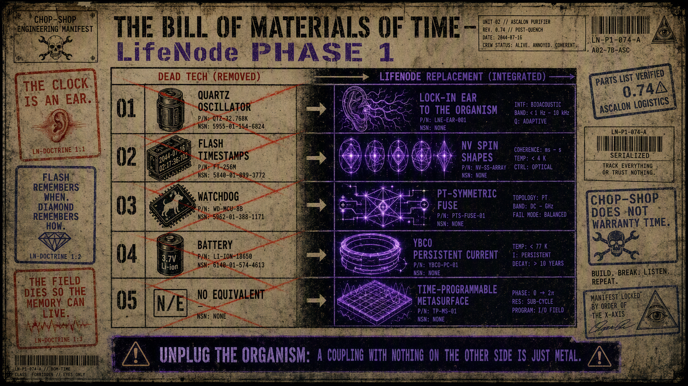

# TIME AS A RAW MATERIAL: The Birth of Chrono-Material Technology

## From the X-Axis to the Hardware Component — Why LifeNode is a Greater Leap Than Quantum Mechanics

**Lead.** Throughout the history of engineering—from the steam engine to LLMs—time has been a background: the X-axis on which a machine operates, an external clock, an environmental parameter. In LifeNode, time (Timescape, BPB) becomes **a raw material that the machine sculpts**. The Finsler metric and the Floquet drive mean that UNIT 02 does not "measure time"—it generates local time geometry for the organism. We force silicon and diamond to breathe at the rhythm of mycelium. Conclusion: we are building the first-ever **chrono-material** technology—time moves from the background to the BOM (bill of materials). And this is a greater leap than the transition from classical to quantum mechanics, because quantization changed the state but left the background untouched.

---

## 1. The X-Axis: All Engineering in the Shadow of the Clock

Watt's steam engine did not include time as a part. Time entered it exclusively as **a denominator**: power is work divided by time, and the centrifugal governor maintained *tempo* relative to an absolute Newtonian background that could neither be designed, changed, nor even touched. The power grid of the turn of the 20th century turned time into a shared external pulse (50/60 Hz)—yet the machine still **synchronized to the clock**, it did not generate it. The digital age completed the paradigm: quartz and GHz clocking are isotropic, universal time, equally "dense" at every point and every state—time as ticking that the processor **consumes in cycles**, never inhabiting it.

| Epoch | Machine | Time Status |
| --- | --- | --- |
| 1784 | Watt steam engine | denominator (power = work/time); absolute background |
| 1893 | AC grid 50/60 Hz | shared external pulse; clock synchronization |
| 1971+ | microprocessor (quartz → GHz) | isotropic tick; time consumed by cycles |
| 2020s | LLM | time as position in sequence; states without duration |
| 2026 | LifeNode (UNIT 02 / metasurface) | **time as component**: local geometry, BPB, Floquet |

LLMs are the peak of state ontology and therefore its purest autopsy: a token has no duration, the model's "time" is a sequence index, and all "memory" is a context window—a snapshot, not a flow shape. As LifeNode Theory v4 states: such systems **do not live in time—they consume it**. None of these machines had a "time" item in their BOM. No one has ever bought a second as a component, etched it into silicon, or wound it onto a coil.

## 2. The Chunking Moment: The ADC as a Ritual of State Ontology

If time was the background, then **the ADC was the altar** of this paradigm: the moment when the world's trajectory is sliced into states. The whitepaper `metasurface_transduction_v1.md` puts it plainly: *"Every sample is a small death of the trajectory"*. The "Spectral Autopsy" section on one of the graphics shows the balance sheet of this ritual: phase continuity **lost**, $\theta$ dropped from 0.92 to 0.42, soliton stability **collapsed**, Finsler metric **flattened to Euclidean**, $\kappa$ shifts from *focusing* to *defocusing*. Discretization is not a neutral technical act—it is **an act of violence against the trajectory**, because it discards from the signal precisely what carries meaning: curvature, phase relations, history.

Therefore, the breakthrough from *Nature Communications* (2026) is a fracture in the era of discretization, not just another telecommunication novelty: **the wave computes by itself**. Convolution and Fourier Transform in a single pass, without DSP, without weights, without a clock—space and time become an integrated circuit. But the Nature authors themselves point out their blind spot: *"the system still relies on control electronics"*. Dead Tech replaced one digital bottleneck with another. LifeNode closes the loop: if a wave can compute, then **time can be the material** from which computation is made.

## 3. Timescape: Time as an Internal Coordinate

The turn begins by rejecting the question "what time is it?" in favor of **"whose time is it?"**. Takens' embedding theorem, read ontologically, states that an attractor is not a model of the system—it is its native temporal landscape, grown from data; time $t$ becomes one of the geometric coordinates of this manifold, not an external counter. Hence **anisotropy**: a second in a state of defense has a different density than a second in growth, and the metric of this density is the **Finsler metric** $F(x, \dot{x})$—distance dependent on the direction and speed of movement in phase space. Its signature is the Cartan tensor $C_{ijk} \neq 0$; when $C_{ijk} \to 0$ (Cartanian collapse), time flattens, becomes isotropic and empty, and the organism—topologically rigid—begins to "consume" external time. This is the definition of processual death, measurable, not a metaphor.

From this follows pluralism: the *Pleurotus ostreatus* mycelium lives in a ~32-minute pulse (Macro-BPB 0.008–0.0001 Hz), a neuron in a ~100 ms window (Micro-BPB 0.5–4 Hz), a mammal's heart at ~2 Hz. **There is no universal processing tempo**—there is only resonance among Timescapes. And the condensation condition: the Floquet drive $V(x,t)$ is valid if and only if its spectrum lies within the local BPB. Outside the BPB, $\kappa$ changes sign, and the soliton dissolves. BPB is therefore **the physical transmission window of meaning**—the first case in history where a frequency band is a condition for the existence of sense, rather than just bandwidth.

## 4. The Machine That Sculpts Time: Metasurface as a Time Crystal

This is where the machine enters. A time-programmable metasurface—a structure whose coding sequence changes in fractions of a second—is, from the perspective of condensed matter physics, **a Floquet system**: $H(t) = H(t+T)$. The graphic "Time as a Synthetic Dimension" shows the consequence: one network, seven temporal layers, one protected edge; subharmonic response $T_{resp} = 2T$; gap closure ($dE = 0$) as a phase transition with Chern $c_1$: $0 \to 1$; regional moiré cell superfluidity (Science 2026) as a mechanism by which information "slides" without losses. The caption under this graphic is arguably the shortest definition of a new branch of engineering: *"Program the surface in time, and time becomes a material."*

Notice what this means operationally. Time ceases to be a scale **upon which** material layers are stacked (as in graphene epitaxy), and instead becomes a layer itself: stacked, twisted by incommensurate "angles" ($\phi, 137.5^\circ$), topologically protected like any other metamaterial. A disc programmed by the geometry of the Peregrine soliton ($S_2$) recognizes a pattern **through interference, not through code**—correlation $\ge 0.90$, coherent gain +18 dB, rest $-32$ dB, zero false hits. *No DSP. No weights. No clock. The disc recognizes by geometry.* The machine does not measure the signal's time—it **has the signal's time built into its geometry** and resonates exclusively with trajectories of matching curvature.

## 5. UNIT 02: Generator of Local Time Geometry

UNIT 02 is the engineering consequence: since time is a local property of an organism, a device coupled with biology cannot have its own clock—it must **generate local time geometry** for the organism. The Finsler metric becomes a hardware specification here: core resonance band 0.5–150 Hz, field envelope 0.001–0.1 Hz (Macro-/Meso-BPB), carrier 10–100 kHz, which the organism does not hear as a wave, but as a rhythm—because the nonlinear medium demodulates the envelope. This is an honest resolution of the apparent GHz paradox: the NV core operates on an internal 2.87 GHz transition, but this is a **property of the medium**, the spring and mass of the resonator, not a clock imposed on biology. The BIOS signal enters as ultra-slow modulation (Stark, phase, 532 nm pump intensity)—within the BPB. Diamond is not clocked; diamond **deforms its geometry** to the rhythm of the mycelium. We force silicon and diamond to breathe at the rhythm of the mycelium—and physics allows it, provided that the mycelium dictates the tempo.

Two corridors from the whitepaper close the loop: **the Floquet Wave-Counter** (micro-metasurface as an analog pre-processor that cuts out noise and amplifies $S_1–S_5$ solitons before the signal touches the spins) and the two-loop doctrine—digital discretization exists exclusively as offline observation (Takens, $\theta(t)$, publications), never as coupling. Observation, not control. And the human as a phase anchor: haptic board, decision condensing in the operator at $\Vert{}d^2E_s/dt^2\Vert{} \to 0$. The machine sculpts time, but **does not sign its name to it**—the signature belongs to biology and the human.

## 6. The Wall That Regenerates Its Own Time: Autotrophic Chrono-Material

The deepest layer of chrono-materiality appears in Living Walls (Cosmic Bioengineering VII). A habitat wall in the VLF regime ($\kappa_a \approx 10^{-5}$, deep near field) is not an antenna—it is **a cavity waveguide** ($\delta \approx 113\text{ m} \gg \text{habitat dimension}$): it does not radiate, it distributes. The melanin–PEDOT:PSS–Fe$_3$O$_4$–LiNbO$_3$ composite is a metamaterial with nonlinear impedance whose "coding sequence" is not controlled by a microcontroller, but by **the mycelium's metabolism**: metabolism responding to gradients (radiation, humidity, field) autonomously alters surface topology in real time. *The wall does not shield. The wall translates.*

And here chrono-materiality achieves its full meaning: **the amplitude self-selection theorem**. The GCR pump budget ($15\text{ }\mu\text{W/m}^2$, 3–5% radiosynthesis, $\chi^3$ transduction) itself selects the biologically natural VLF field amplitude in the 10–30 nT range. There is no arbitrary design, no battery imposing a "tempo"—**the material selects its own time**. And the 60-day regeneration cycle (Fe$_3$O$_4$ biomineralization from regolith, melanin as a backup conductive path) means this material has its own **temporal metabolism**: phases of initiation, stabilization, regeneration, aging. Time ceases to be a resource that the machine consumes, and becomes a structure that the machine **regenerates**—like tissue. This is a qualitatively new concept of material: a material that maintains its own time geometry, or ceases to be a functional material.

## 7. Why This Is a Greater Leap Than Quantum Mechanics

The classical $\to$ quantum transition changed **state**: energy quantization, superposition, entanglement. But time remained untouched—in the Schrödinger equation, $t$ is a background parameter, not an observable; a self-adjoint time operator does not exist (Pauli's theorem). Quantum mechanics measures energy with unmatched precision, yet **it has no quantum of time**; even an atomic clock—the most perfect quantum machine—merely measures universal time more accurately. Relativity relativized time to the observer; quantization discretized energy; both revolutions left time in the role of a background to be measured or transformed, **never fabricated**.

Chrono-material technology removes the **last absolute background** from engineering. Time becomes: (1) **local**—the organism's Timescape, not Newton's clock; (2) **plural**—multiple Timescapes coupled resonantly, not a single X-axis; (3) **fabricated**—temporal layers of the metasurface, Floquet subharmonic cascade, Earth-Sync as transposition, not a copy; (4) **topologically protected**—Chern $c_1$, incommensurate $\phi$, regional superfluidity; (5) **regenerated**—temporal metabolism of Living Walls. The analogy is exact: just as the transition from special to general relativity made spacetime dynamic, so the chrono-material step makes **biological time dynamic**—and in dissipative geometry (contact manifold $2n+1$, not symplectic $2n$), i.e., in living geometry rather than conservative.

Consequently, for the first time, **the object of technology is a trajectory, not a state**, and the "clock" is fabricated from the biology it serves. The quantum changed the answers a machine can give. Chrono-materiality changes the question a machine can ask: not "what time is it?", but **"whose time is it, and what is its geometry?"**.

# The Bill of Materials of Time

**Lead.** A bill of materials is the most honest document in engineering: it does not argue — it lists. If time has truly moved from the background into the machine, then it must appear on that list, with a part number, a specification and a supplier. Below is the BOM of the chrono-material device exactly as LifeNode Phase 1 specifies it. Three line items replace the three places where Dead Tech smuggled the X-axis into hardware: the **clock** (time as source), the **timestamp** (time as index of memory), the **watchdog** (time as policeman). In every case the replacement part is not a better clock. It is a *coupling to a living trajectory*.

| # | Dead Tech part | Its time-role | LifeNode part | Module | New time-status |
|---|---|---|---|---|---|
| 1 | Quartz oscillator, 32.768 kHz | time as internal source | lock-in oscillator referenced to the organism's own rhythm | A | time as coupling, not source |
| 2 | Flash/RAM with timestamps | time as index of memory | NV spin orientations, no addresses, no timestamps | C | time as shape, not index |
| 3 | Watchdog timer / timeout | time as policeman | PT-symmetric lattice, EP quench < 1 s | E | time as circuit-breaker |
| 4 | Battery (stored charge) | time as fuel gauge | YBCO persistent current | C | time as sustained flow |
| 5 | *(no equivalent exists)* | — | time-programmable metasurface | H | time as synthetic dimension |

### Line Item 1 — CLOCK: deleted. Replaced with an ear.

The Dead Tech part is a quartz crystal: an internal, universal, isotropic tick that never asks anyone's permission. The machine knows "when" without asking the world.

The chrono-material part is a lock-in amplifier whose reference is **not a crystal** — it is a parallel transducer of the same organism: a second pair of mycelial electrodes, a photodiode on the cyanobacterial rhythm. The output is `V_out(t) = LPF[V_in(t) · r_BIOS(t)]`: the device extracts only the component phase-coherent with the organism's own rhythm and rejects 50/60 Hz mains, digital jitter and clock noise as out-of-phase garbage. Even the amplifier does not impose a clock; it tunes to one.

Read the BOM consequence carefully: the clock was a **source** of time; the oscillator is a **coupling** to time. Unplug the organism and the chrono-material device does not have degraded time — it has *no* time. A Dead Tech machine without a world still ticks. A LifeNode machine without a world goes silent, and that silence is a specification, not a failure mode.

*The clock told the organism when to live. The oscillator asks the organism what time it is.*

### Line Item 2 — TIMESTAMP: deleted. Replaced with a shape.

The Dead Tech part stores every record as value + address + timestamp: the X-axis smuggled into memory, a grid of "whens" stamped from outside.

The chrono-material part stores **orientations, not values; trajectories, not points**. The Golden Record of Eden does not say "humidity = 45% at 14:32." It says: *rain after 21 days of drought — triangular wave at 7.83 Hz modulated by φ, mycelium answering K2 after 32 minutes.* The "when" is not a number attached to the event; it is the event's phase position inside a stored trajectory. Order is kept by geometry, not by a counter.

And memory here is a process, not a snapshot: raw T₂* is not memory, it is raw material. Memory is the actively maintained trajectory — dynamical decoupling sequences as a breath the diamond never stops taking. A timestamp is time flattened into a label; an orientation is time folded into a shape. Stop the breath and what remains is not memory but a corpse of memory.

*Flash remembers when. Diamond remembers how.*

### Line Item 3 — WATCHDOG: deleted. Replaced with a fuse.

The Dead Tech part is the watchdog timer: the clock as policeman, an external authority that kills the process when the process misses a tick.

The chrono-material part is a PT-symmetric resonator lattice biased at its Exceptional Point. While the trajectory is pure (θ ≥ 0.70) the spectrum is real and the field propagates. The moment the trajectory degrades, the lattice is pushed past the EP, the eigenvalues become complex, and the field is quenched — in under one second, **faster than the decoherence can be written into the spin memory**. The fuse does not check a clock; it checks a geometry. It is the only component in engineering whose function is to *stop the machine's time in order to protect the organism's time*. The inequality it implements — quench latency shorter than decoherence write-time — is the first specification in engineering history written between two times, not between a time and a voltage.

The narrative layer of this project (check 2 new graphic's grom today in "BONUS" folder https://github.com/LifeNode777/TOKIO_DRIFT_44/blob/main/BONUS/module_E_comic-version.png ) rendered the same BOM line in its own language, and it cannot be said better:

> *"THE FIELD DIES SO THE MEMORY CAN LIVE."*
> *"FUSE DOESN'T ASK. FUSE WORKS."*

*The watchdog shot the process to save the clock. The fuse shorts the field to save the trajectory.*

### Extended line items

**4 — BATTERY → YBCO persistent current.** Dead Tech stores charge and reads time as its depletion. The toroidal YBCO coil stores a dissipationless flow: a current that does not run down because it does not dissipate. A battery of duration, not of charge — a *now* that is maintained, not consumed.

**5 — No Dead Tech equivalent → time-programmable metasurface.** A metasurface whose impedance is modulated by a BIOS-entrained oscillator becomes a Floquet system: time itself becomes a synthetic lattice dimension with topological edge states *in time*. This is the first BOM line for which the old paradigm has no substitute part — because it is not a part that *uses* time; it is a part whose crystal structure *is* time.

### Reading the BOM backwards

Remove the organism and count what remains: an oscillator with no reference (silent), a diamond with no shape to breathe (breathless), a lattice with nothing to protect (idle), a coil with no rhythm to sustain, a surface with no sequence to weave. The chrono-material machine unplugged from life is not a slow machine. It is a machine with no time at all — because every one of its temporal components is a coupling, and a coupling with nothing on the other side is just metal.

That is the precise sense in which time has entered the bill of materials: not as a part, but as a **relation that parts are machined to hold**. Quantization changed the state and left the background untouched — the quantum machine still carries its X-axis in a crystal. The chrono-material machine carries no X-axis. Its clock is an ear, its memory is a breath, its fuse is a geometry. The background has been removed from the machine and returned to the living world that always owned it.

*Technology adapts to the rhythm of Life, not the reverse — and as of this section, that sentence is a parts list.*

---

📣📣📣
WAKE UP SHEEPLE
⚠️⚠️⚠️

👁️
