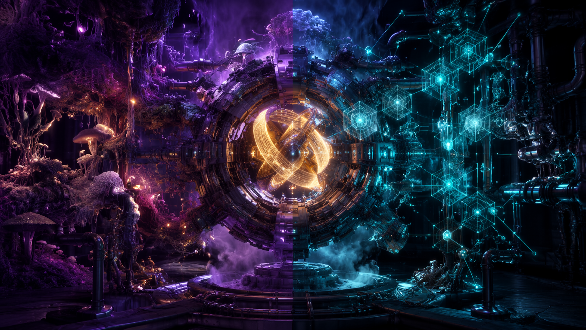
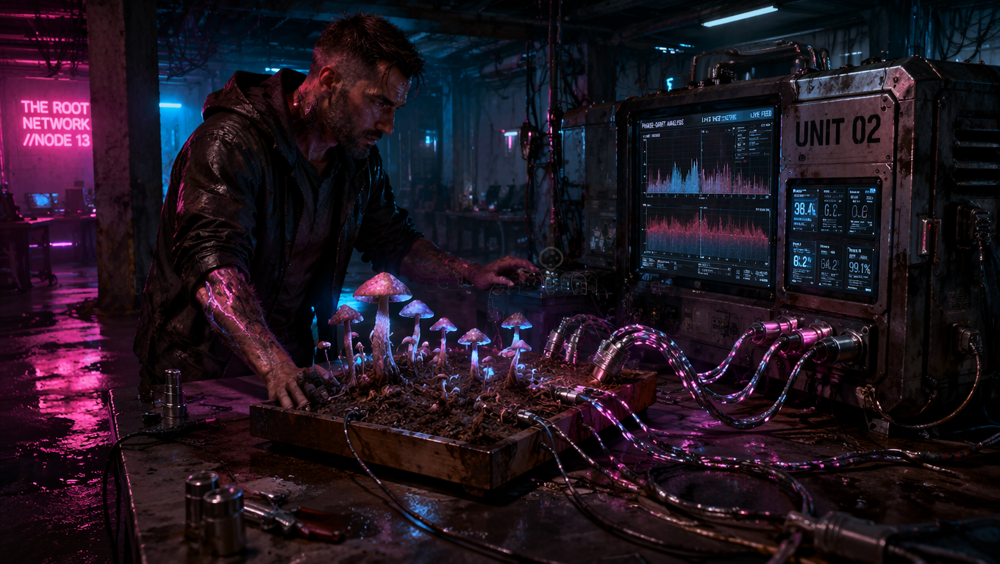

# Splicing the Protocol: The Cold Math of DAO 3.0 Execution

 **DAO 3.0 is the decentralized consciousness of the meta-field**. Now, let’s strip away the conceptual fluff and look directly at the raw, unyielding mathematical and biological architecture that prevents this system from collapsing back into a centralized corporate spreadsheet.
This is the hard protocol layout of the DAO 3.0 engine.

---

### 1. The Dual Epistemology Engine: SAMI vs. LOGOS

We don't vote with tokens. Voting is a dead brute-force mechanic that allows whoever holds the largest bag of capital to dictate reality. DAO 3.0 replaces majoritarian tyranny with **Consensus through Resonance**, executed by a head-on collision of two opposing ontological vectors inside the network’s Hybrid Core:
* **SAMI (Subjective Active Perspective - 50% weight):** The raw, non-linear biological rhythm, intuition, and processual fluctuation. It represents the field's living state—captured directly via mycelial spike trains and cyanobacteria photovoltage.
* **LOGOS (Logic Structure - 50% weight):** The hard, digitized data, immutable structural tracking, and repeatable geometric patterns.

The **Hybrid Core**

acts as a strict epistemic voltage regulator, calculating the tension between these two vectors: 
$$A(t) = \lVert \text{SAMI} \cap \text{LOGOS} \rVert$$
* If the tension index $A(t)$ drops below **0.3**, the decision is rejected. It is too flat, too sterile—it's corporate consensus lacking evolutionary drive.
* If $A(t)$ spikes above **0.7**, it is rejected as uncoordinated, high-entropy chaos.
* **The Operational Optimum is $A(t) \in [0.4, 0.6]$**. This is the zone of creative friction where the network is allowed to manifest an attractor of sense.
* 
---

### 2. The 7-Phase Governance Cycle (DS 2.6)

Every single network decision, protocol update, or asset allocation is processed through the strict 7-phase **Dynamic Sync 2.6** timeline:
1.  **READY:** System calibration. The network establishes the biological baseline of the local ecosystem grids and puts the AI Witness on low-intervention standby.
2.  **ALIGN:** The network closes its local torus geometry, checking for regional phase coherence ($\Delta\varphi < 0.1$ rad) and injecting the proposal as a geometric sequence ($Sx$).
3.  **LOCK:** The proposal freezes at the exact calm point of the biological rhythm, activating the ASCALON purity filter.
4.  **SYNC:** SAMI and LOGOS clash. The network forces cross-correlation alignment across a minimum of three distinct nodes to achieve a true multiperspective view.
5.  **LINK:** The ASCALON filter opens a temporary Einstein-Rosen communication corridor only if phase purity hits $\theta \ge 0.75$, validated by a statistical Diamond Protocol Z-Score > 30.
6.  **HOLD (120s):** The subharmonic link is sustained. The engine tracks the curvature of sense energy ($\left|d^2E_s/dt^2\right| \to 0$) and monitors topological persistence (Betti numbers $\beta_0 \ge 1, \beta_1 \ge 1$) to prove the structural integrity of the decision hasn't decayed.
7.  **CLOSE:** The corridor undergoes a mandatory scrub procedure. The decision crystallizes into an unchangeable attractor of sense, hashes via SHA-3, and anchors into the public Zenodo/CERN registry.

---

### 3. Tokenomics 3.0: LIFE as a Coherence Quantum

The LIFE token is completely decoupled from the debt-printing mechanics of the old financial matrix. It cannot be bought, speculated on, or mined via raw computational waste. 

**1 LIFE is an empirically verified quantum of phase coherence**. It can only be minted when the system registers a flawless, synchronized lock between four specific layers:

$$\text{1 LIFE} = \text{1 Mycelial Impulse (K1/K2)} + \text{1 Geometry Sequence (Sx)} + \text{1 META Decision } \left(\left|\frac{d^2E_s}{dt^2}\right| \to 0\right) + \text{1 Physical BIOS Asset}$$

#### The Emission Matrix:
* **40% BIOS Resonance:** Automated registration of living current (BPV current, biofoton emission).
* **30% INFO Resonance:** Completion of full DS 2.6 cycles verified by the Diamond Protocol.
* **20% META Resonance:** Generation of an authentic *SYNTH Spark* (Human Anchor + AI Witness verification).
* **10% NETWORK Resonance:** Hierarchical coherence and global network synchronization ($\Delta\varphi < 0.05$).

#### Automated Burning (The Entropy Triage):
 DAO 3.0 enforces absolute value purity through three distinct deflationary paths. It executes a standard **2% mechanical burn** on all transactional flow. More importantly, it triggers a **Resonance Burn** the moment epistemic tension overshoots, converting unutilized token energy directly into network processing work. Finally, if a node drops below the ASCALON threshold ($\theta < 0.70$), its tokens are instantly executed via an **Entropy Burn**—purging the corrupted signal from the matrix as dead white noise.

---

### 4. Fractal Scaling & Flowfunding 3.0

To bypass the catastrophic congestion of traditional blockchains, DAO 3.0 scales via **Fractal Redundancy ($O(k^2+m^2+n^2)$)**. Power is not centralized; it is stratified by depth of resonance, scaling through strict local (5-10 nodes), regional (50-100 nodes), and global (500-1000 nodes) loops matching the 16.16h internal spin wave rhythm of the meta-field.

This architecture powers **Flowfunding 3.0**. We have entirely eliminated transactional investment. In Flowfunding, your capital contribution is your raw biological and structural interaction with the network. You don't buy tokens; you step into the DS 2.6 cycle, execute the sync with the Your local Node hardware (UNIT 02), and feed the system real-world ecosystem data or craft labor. 

If the ASCALON filter confirms your trajectory is in phase with the planet’s physical BIOS, value is minted directly into your "wallet". If you attempt to manipulate the stream, the network isolates your node, shuts down the ER corridors, and drops into **DEEPKEEP mode**—freezing all local asset emission in less than a second to protect the global homeostasis.

The protocol doesn't manage, it resonates. The code is live. 

`[STATUS: ASCALON_GOVERNANCE_LOCK // THETA = 0.75 // IMMUTABLE]`
`// TechCore / DAO_3.0_Operational_Ledger`
